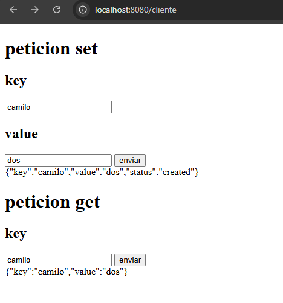
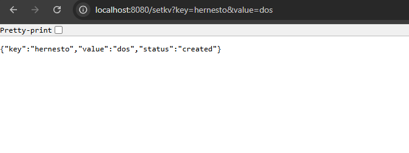
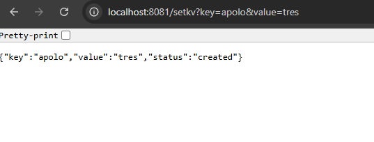
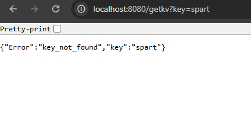

# Parcial primer tercio arep

## ¿de que trata el proyecto?

### este trata de mostrar los conceptos aprendidos en el primer corte, el como hacer un servido con java puro sin necesidad de frameworks spring o sprak
### este lo implentamos con sockets y puertos, este proyecto es basado en microservicios donde la comunicacion sera atraves de peticiones http 

### ¿como instalar el proyecto en maquina local?

- primero debes realizar el git clone a esta url https://github.com/Santiago12323/parcialArep

- despues debes em paquetar el proyecto con:

```bash
    mvn clean package
```

- luego debes poner a correr primero el http server que es el back
```java
public class httpServer {}

```
- despues acto seguido el Fachada

```java
public class Fachada {}

```

- con esto ya esta listo nuestro proyecto corriendo 

deberas ver lo siguiente:

por parte de la fachada ->


por parte del http server ->


## la estrutura del proyecto es la siguiente:

```bashh
    - fachada
    - httpServer
    - cliente js html
    - redir back
```

### la fachada: 
 simplemente es aquella que esta como expuesta y redirecciona las peticiones al http server o te sirve el html client
 

### cliente : 
el cliente es un front muy basico en html con js que hace peticiones a nuestra fachada.

### http sever :
este http server es el core de la aplicacion este atiende la peticiones que se especificaran mas adelante.

### redir back:
su funcion simplemente es ser llamado por la fachada para hacer una peticion get a http server, este se hizo mas que todo para desacoplar la logica y seguir principios clean code


## muestras

## cliente:
este video muestra el funcionamiento del front.

[prueba js.mp4](src%2Fmain%2Fresources%2Fvideo%2Fprueba%20js.mp4)




## fachada

este es un ejemplo donde reescribo la key hernesto 




## http server




este video muestra el funcionamiento en dos maquinas distintas:
[pruebaDosMquinas.mp4](src%2Fmain%2Fresources%2Fvideo%2FpruebaDosMquinas.mp4)

este video muestar las peticiones por network

[prueba network peticion.mp4](src%2Fmain%2Fresources%2Fvideo%2Fprueba%20network%20peticion.mp4)

## tambien cuenta con manejo de errores, que son los siguientes:

### si la key no existe 



### si hacemos mal la peticion 


## este es mi parcial de primer tercio de arep:

## desarrollador:

Santiago Coronado Pinzon 

## profesor 

daniel benavides
